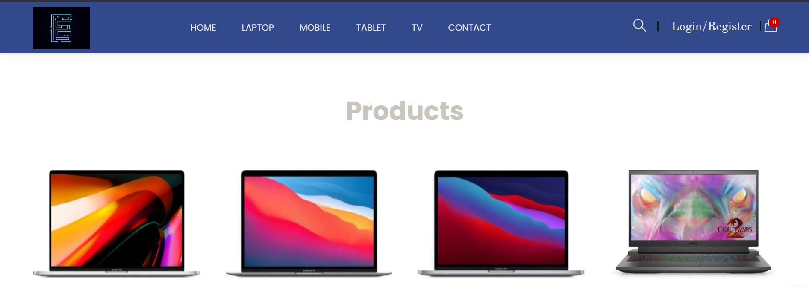

# new_aws_php
This project is deployed with AWS. 
Used AWS services: 
1. Vpc
2. EC2 (Target group, Application Load balancer, Autoscaling), 1 public EC2 for accessing 1 private EC2. t2.micro, Amazon Linux.
3. RDS(private, t2.micro)
4. Autoscaling
5. Cloud Front for Application Load Balancer
6. Addedd sub domain
7. AWS code pipeline: Application code deploys the private instance through the AWS code pipeline

Project overview

